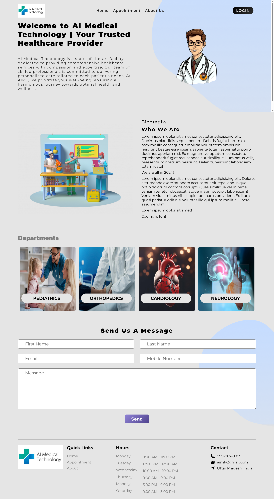
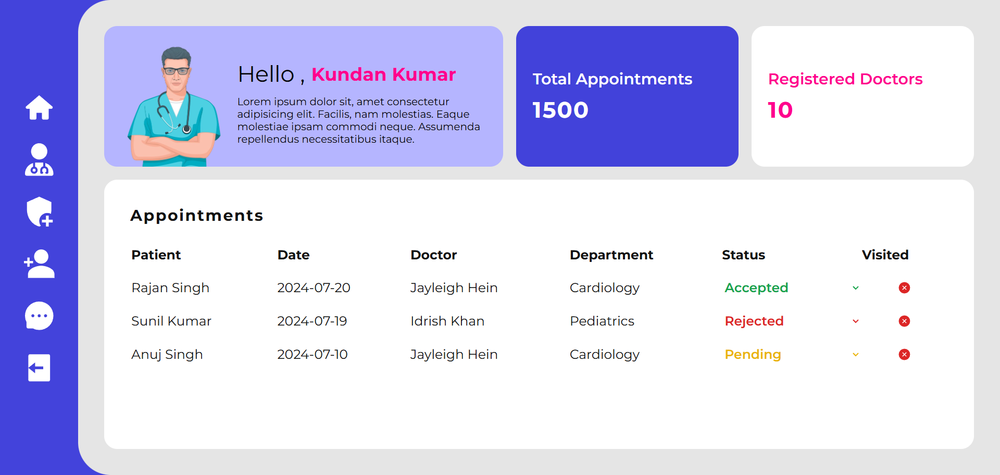
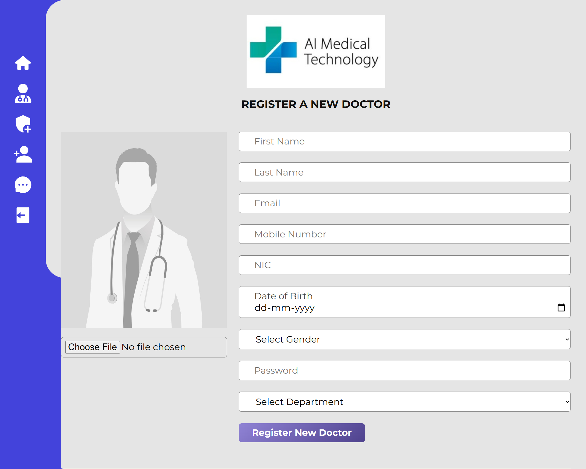

# 🏥 Hospital Management System

A **MERN Stack** based Hospital Management System that allows patients to easily register for appointments, and enables the admin to manage doctors, appointments, and patient data efficiently.

---

## 📌 Features

- **Patient Registration** – Patients can enter their details on the homepage to register for an appointment.
- **Doctor Management** – Admin can view the list of doctors, register a new doctor, and manage their availability.
- **Appointment Management** – Admin can approve or reject patient appointments based on doctor availability.
- **Secure & Scalable** – Built using MERN stack with clean architecture for easy maintenance.
- **User-Friendly UI** – Simple, responsive, and easy-to-use interface for both patients and admins.

---

## 🖼️ Screenshots


### 1️⃣ Homepage – Patient Registration


### 2️⃣ Admin Dashboard – Appointment Management


### 3️⃣ Doctor List – Add & View Doctors


---

## 🚀 Live Demo
[Click Here to View Homepage](https://hospital-management-syst-frontend.netlify.app/)
[Click Here to View Admin_dashboard](https://admin-dashboard-hospital-mngt-sys.netlify.app/)

---

## 🛠️ Tech Stack

- **Frontend:** React.js, HTML5, CSS3, JavaScript
- **Backend:** Node.js, Express.js
- **Database:** MongoDB
- **Hosting:** (e.g., Vercel, Netlify, or Heroku)

---

## 📂 Installation

```bash
# Clone the repository
git clone https://github.com/yourusername/hospital-management.git

# Navigate to the project folder
cd hospital-management

# Install frontend dependencies
cd client
npm install

# Install backend dependencies
cd ../server
npm install

# Run the backend
npm start

# Run the frontend (in a separate terminal)
npm start
